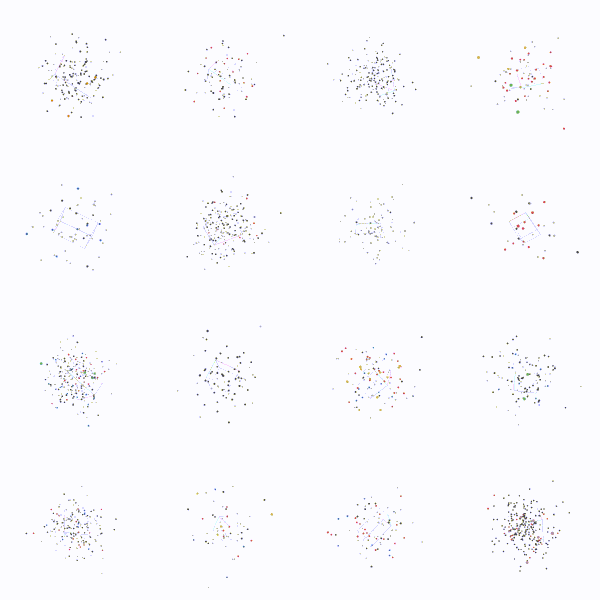

<div align="center">

# Fast Organic Crystal Structure Prediction <br> with Unit Cell Flow Matching

[](https://arxiv.org/abs/2606.03199)
[](https://huggingface.co/the-matter-lab/clari)

<br>



</div>

<br>

This repository contains code to reproduce the paper: Fast Organic Crystal Structure Prediction with Unit Cell Flow Matching ([arXiv](https://arxiv.org/abs/2606.03199)).

---

## Installation

To install only the required packages for CLARI to run inference:

```bash
pip install clari
```

or by cloning the repository and running
```bash
uv sync
```

## Inference

The workflow has three steps:

1. `clari` — sample candidate crystal structures → `predictions.parquet`
2. `rank` — score with FairChem UMA energy → `rankings.csv`
3. `export-cifs` — write `.cif` files to disk

Models (`clari-m`, `clari-l`, `clari-h`) download automatically from HuggingFace on first use.

### Quickstart

```bash
# 10 candidate structures for ethanol, written to results/CCO_x4/
uv run clari "CCO" --samples 10
```

The grammar is `clari SMILES [copies] [SMILES [copies]]...` — a request is a flat
list of `(component, copies)` pairs. Dots in a SMILES split into components, a
copies value broadcasts over the dot components of its token, and omitted copies
default to 4 (the Z value, molecules per unit cell). Hydrogens are added
automatically.

```bash
uv run clari "CC(=O)Oc1ccccc1C(=O)O" 1 "O" 3 --samples 8   # aspirin trihydrate co-crystal
uv run clari "CCO.O" 2                                     # dotted SMILES: (CCO,2),(O,2)
uv run clari "CCO" --model clari-h --id ethanol            # pick model, label outputs
```

`--smiles`/`--copies` flags are a synonym of the positional form (use one or the
other): `clari --smiles "CC(=O)Oc1ccccc1C(=O)O" --copies 1 --smiles "O" --copies 3`.

**`--id`** labels the output rows and becomes the CIF subdirectory name;
auto-generated from SMILES if omitted. **`--output_dir`** defaults to `results/<id>`.

### Batch via config

```bash
uv run clari --config batch.json
```

```json
{
  "model": "clari-m",
  "output_dir": "results/batch_run",
  "requests": [
    { "id": "ethanol", "smiles": "CCO", "copies": 4, "samples": 4 },
    {
      "id": "aspirin_trihydrate",
      "smiles": [["CC(=O)Oc1ccccc1C(=O)O", 1], ["O", 3]],
      "samples": 4,
      "batch_size": 8
    }
  ]
}
```

Top-level keys (all optional): `model`, `output_dir`, `use_ema`, `use_bf16`, `pbar`.
Per-request keys: `id`, `smiles`, `copies`, `samples`, `batch_size`.

### Rank

Requires `fairchem-core`:

```bash
pip install "clari[uma]"   # or: uv sync --extra uma
uv run --extra uma rank results/ethanol
```

### Export CIFs

```bash
uv run export-cifs results/ethanol                         # all samples
uv run export-cifs results/ethanol --top_k 3               # top 3 ranked (requires rankings.csv)
uv run export-cifs results/ethanol --sample_idx 0 --sample_idx 2
uv run export-cifs results/batch_run --ids ethanol         # one molecule from a batch parquet
uv run export-cifs results/ethanol --output_dir my_cifs/
```

Filenames: `<id>/sample_000000.cif` without rankings, `<id>/rank_0000_sample_000000.cif` with.

### Python API

```python
from clari.inference import ClariSampler

sampler = ClariSampler("clari-m")

crystals = sampler.sample("CCO", id="ethanol", samples=8)                    # in-memory
sampler.sample("CCO", id="ethanol", samples=8, output_dir="results/ethanol") # disk-backed

# Co-crystal: dot-separated SMILES (uniform copies) or list (per-component copies)
sampler.sample("CCO.O", id="ethanol_hydrate", copies=2, samples=4)
sampler.sample(
    ["CC(=O)Oc1ccccc1C(=O)O", "O"],
    id="aspirin_trihydrate",
    copies=[1, 3],
    samples=4,
    output_dir="results/aspirin_trihydrate",
)
```

`sample()` kwargs: `id`, `copies` (int or list, default 4), `samples` (default 1), `output_dir`.

### Rank and export from Python

```python
from clari.inference import save, rank, export_cifs

crystals = sampler.sample("CCO", id="ethanol", samples=100)
save(crystals, "results/ethanol")

df = rank("results/ethanol")  # writes energies.csv + rankings.csv, returns DataFrame
df = rank(crystals)           # fully in-memory: ranks a list of Crystals, writes nothing

export_cifs("results/ethanol")
export_cifs("results/ethanol", top_k=3)
export_cifs("results/ethanol", sample_idx=[0, 2])
export_cifs("results/ethanol", output_dir="my_cifs/ethanol")

export_cifs(crystals, output_dir="my_cifs/", id="ethanol")
```

See also: [inference reference](clari/inference/SKILL.md).

## Development Installation

To install all dependencies needed for development (in editable mode):

```bash
pip install -e ".[dev]"
```

Or using `uv` to sync the full development environment:

```bash
uv sync
```

⚠️ To generate data and run COMPACK, we require the **CCDC SDK**, whose dependencies conflict with FairChem. Thus, some scripts run as standalone uv scripts that resolve their own isolated environments from the CCDC index. The first invocation of `uv run -s *.py ...` resolves and caches that environment. You will still need a valid CCDC license configured on the machine.

## Data

### Generation

We expect the final data folder to be structured as follows:

```
data/
    raw/
        csd_metadata.parquet
        csd_conquest.parquet
    csd/
        config.json
        metdata.parquet
        {train,val,test}.pt
```

To generate the data, first extract the metadata of entries in CSD:

```
uv run -s scripts/data/0_metadata.py
```

This creates the `csd_metadata.parquet` file from above. Next, download **ALL** of CSD in `.mol2` and `.cif` format using ConQuest (not `csd-python-api` since it sanitizes molecules and removes some bond information) into the `csd_conquest.parquet` file. Finally, generate the `data/csd` folder with:

```
uv run python -m scripts.data.1_process --num_workers=16
```

For reference, the CSD refcodes we use and our dataset split are uploaded to [HuggingFace](https://huggingface.co/the-matter-lab/clari).

## Evaluation

Training and evaluation paths default to `data/`, `results/`, and `logs/` under the current working directory. Override them with `CLARI_DATA_DIR`, `CLARI_RESULTS_DIR`, and `CLARI_LOG_DIR`; see [`clari/paths.py`](clari/paths.py).

### OXtal and Teaching Test Sets

To reproduce the paper numbers, run the stages below in order. Each stage writes into the same `<experiment_dir>` and reads what the previous stage produced.

These evaluation commands require the prepared `data/csd` directory described above. When running CLARI from an installed package, run the commands from a working directory containing `data/csd`, or set `CLARI_DATA_DIR=/path/to/data`.

```bash
# 0. One-time: build the GT CIF cache the standalone compack script reads
uv run python clari/evaluation/build_test_cifs_cache.py

# 1. Sample the CSD test set, creates a folder results/experiment_dir.
#    Use clari-m, clari-l, or clari-h as the first argument.
uv run sample-test clari-m <num_samples> <experiment_dir> --subset <teaching/oxtal>

# 2. Clash check (writes collision.csv)
uv run collision <experiment_dir>

# 3. UMA energies (writes energies.csv)
uv run compute-energies <experiment_dir>

# 4. COMPACK packing similarity (writes compack.csv, isolated uv script env)
uv run -s clari/evaluation/compack.py <experiment_dir> --num_processes n

# 5. Summary table (SolC per subset, all k)
uv run summarize <experiment_dir>
```

### Ablations

The exact commands used for to train our ablated and final models can be found in `scripts/train`. After running inference as above, the metrics used for ablations are defined in:

```
from clari.pipelines.utils.metrics import assess_crystals_eval
```

## Citation

```bibtex
@misc{lo2026clari,
      title={Fast Organic Crystal Structure Prediction with Unit Cell Flow Matching},
      author={Alston Lo and Luka Mucko and Austin H. Cheng and Andy Cai and Alastair J. A. Price and Wojciech Matusik and Alán Aspuru-Guzik},
      year={2026},
      eprint={2606.03199},
      archivePrefix={arXiv},
      primaryClass={cs.LG},
      url={https://arxiv.org/abs/2606.03199},
}
```
